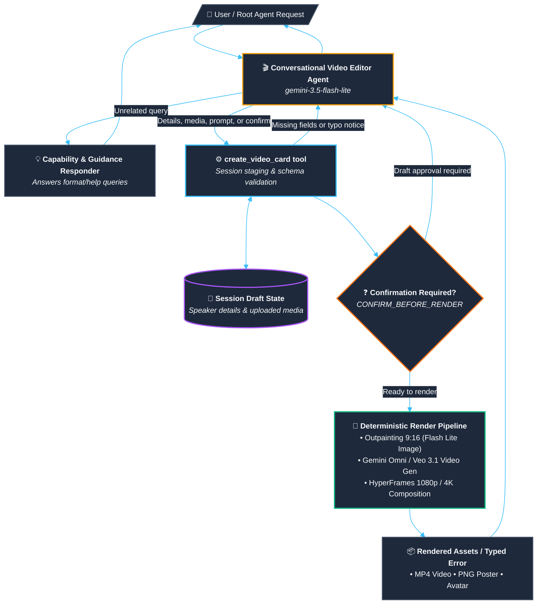

# Video Editor Agent Flow

> **Visual Assets**: [🖼️ PNG Diagram](file:///Users/aplachykau/Experiments/gdg_krakow_tool/agents/video_editor/docs/assets/video_editor_dag.png) • [📄 PDF Document](file:///Users/aplachykau/Experiments/gdg_krakow_tool/agents/video_editor/docs/assets/video_editor_dag.pdf) • [📐 SVG Vector](file:///Users/aplachykau/Experiments/gdg_krakow_tool/agents/video_editor/docs/assets/video_editor_dag.svg)

