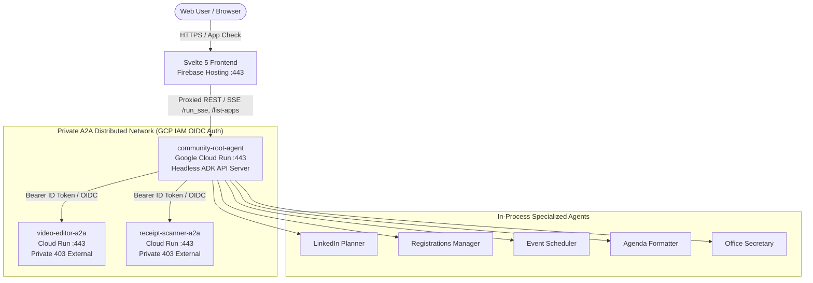

# 🚀 Community AI Studio — Multi-Environment Deployment & Migration Guide

This guide explains step-by-step how to deploy **Community AI Studio** to a brand new environment (Google Cloud Platform, Firebase Hosting, Cloud Run, or custom domains) with **zero hardcoded values**.

---

## 📑 Table of Contents
1. [Architecture Overview & Network Topology](#1-architecture-overview--network-topology)
2. [Prerequisites & Minimal Build Requirements](#2-prerequisites--minimal-build-requirements)
3. [Environment Configuration (.env)](#3-environment-configuration-env)
4. [Backend Deployment (Google Cloud Run)](#4-backend-deployment-google-cloud-run)
5. [Frontend Deployment (Firebase Hosting / Vercel)](#5-frontend-deployment-firebase-hosting--vercel)
6. [Google Drive & Docs Automation Setup](#6-google-drive--docs-automation-setup)
7. [Online Verification & Health Checklist](#7-online-verification--health-checklist)

---

## 1. Architecture Overview & Network Topology



All microservices communicate via dynamic URLs configured via environment variables and IAM:
- **`VIDEO_AGENT_A2A_URL`**: Full HTTPS URL to the Video Editor A2A service. Authenticated via Google OIDC ID tokens.
- **`RECEIPT_AGENT_A2A_URL`**: Full HTTPS URL to the Receipt Scanner A2A service. Authenticated via Google OIDC ID tokens.
- **`VITE_API_URL`**: Full URL to the Root Orchestrator backend (empty in production to leverage native Firebase Hosting rewrites).
- **Service Account**: `community-studio-runtime@<project_id>.iam.gserviceaccount.com` (Least privilege).

---

## 2. Prerequisites & Minimal Build Requirements

To deploy from a new machine or CI/CD runner:
- **Python 3.12+** with `uv` (`curl -LsSf https://astral.sh/uv/install.sh | sh`)
- **Node.js 22+** with `npm`
- **Google Cloud SDK (`gcloud`)** (`gcloud auth login`)
- **Firebase CLI** (`npm install -g firebase-tools` or `npx firebase-tools`)

---

## 3. Environment Configuration (.env)

Create your `.env` in the repository root (see [`.env.example`](file:///Users/aplachykau/Experiments/gdg_krakow_tool/.env.example)):

```bash
cp .env.example .env
```

### Essential Parameters:

| Variable | Description | Example |
| :--- | :--- | :--- |
| `GOOGLE_GENAI_USE_VERTEXAI` | `1` for Vertex AI (ADC), `0` for API key mode | `1` |
| `GOOGLE_CLOUD_PROJECT` | Target GCP Project ID | `your-gcp-project-id` |
| `GOOGLE_CLOUD_LOCATION` | Vertex AI region (`global` or `europe-central2`) | `global` |
| `GOOGLE_API_KEY` | Google AI Studio API Key (if `USE_VERTEXAI=0`) | `AIzaSy...` |
| `COMMUNITY_NAME` | Community/Organizer brand name | `Your Community Name` |
| `VIDEO_ENGINE` | Video generator engine | `omni` |

---

## 4. Backend Deployment (Google Cloud Run)

### Option A: Terraform Infrastructure as Code (Recommended for Multi-Environment)

You can provision and deploy all services declaratively using the modular [Terraform module](file:///Users/aplachykau/Experiments/gdg_krakow_tool/terraform):

```bash
# 1. Authenticate with your target GCP project:
gcloud auth application-default login
gcloud config set project YOUR_TARGET_GCP_PROJECT_ID

# 2. Deploy infrastructure and services via Terraform:
make tf-deploy
# OR:
bash deploy/deploy_terraform.sh
```

See [terraform/README.md](file:///Users/aplachykau/Experiments/gdg_krakow_tool/terraform/README.md) for custom variables (`terraform.tfvars`) and fine-grained resource tuning.

### Option B: Automated Cloud Run Script

The automated script [`deploy/deploy_a2a_cloudrun.sh`](file:///Users/aplachykau/Experiments/gdg_krakow_tool/deploy/deploy_a2a_cloudrun.sh) handles container builds via Cloud Build and deploys all 3 services in order:

```bash
# Make sure you are authenticated with GCP:
gcloud config set project YOUR_GCP_PROJECT_ID

# Run the automated deployment:
make deploy
# OR:
bash deploy/deploy_a2a_cloudrun.sh
```

### What the deployment does automatically:
1. **Enables GCP APIs**: Cloud Run, Cloud Build, Artifact Registry, Storage, Vertex AI, Docs.
2. **Deploys Video Editor A2A**: (`deploy/Dockerfile.video_editor`) with 8Gi RAM, 4 vCPUs.
3. **Deploys Receipt Scanner A2A**: (`deploy/Dockerfile.receipt_scanner`) with 4Gi RAM, 2 vCPUs.
4. **Deploys Root Orchestrator**: (`deploy/Dockerfile.root`), dynamically injecting the URLs of Video Editor and Receipt Scanner.
5. **Builds Frontend**: Runs `npm run build --prefix frontend`.
6. **Deploys Firebase Hosting**: Deploys the frontend and configures Cloud Run rewrites.

---

## 5. Frontend Deployment (Firebase Hosting / Vercel)

### Option A: Firebase Hosting (Recommended)

1. Set your Firebase project in `.firebaserc`:
```json
{
  "projects": {
    "default": "YOUR_FIREBASE_PROJECT_ID"
  }
}
```
2. Build and deploy:
```bash
make deploy-frontend
# OR:
npm run build --prefix frontend && npx -y firebase-tools deploy --only hosting --project YOUR_FIREBASE_PROJECT_ID
```

### Option B: Vercel / Netlify / Custom Domain

1. In your host's environment settings, set:
   - `VITE_API_URL` = `https://community-root-agent-XXXXX.a.run.app`
   - `VITE_FIREBASE_PROJECT_ID` = `YOUR_FIREBASE_PROJECT_ID`
   - `VITE_FIREBASE_API_KEY` = `YOUR_FIREBASE_API_KEY`
   - `VITE_FIREBASE_AUTH_DOMAIN` = `YOUR_FIREBASE_AUTH_DOMAIN`
2. Build command: `npm run build --prefix frontend`
3. Output directory: `frontend/dist`

---

## 6. Google Drive & Docs Automation Setup

For automated Google Docs expense report creation:

1. **Enable APIs**:
   ```bash
   gcloud services enable docs.googleapis.com drive.googleapis.com --project=YOUR_PROJECT_ID
   ```
2. **Create Service Account**:
   ```bash
   gcloud iam service-accounts create receipt-docs-bot \
     --description="Service account for automated expense Google Docs" \
     --display-name="Receipt Docs Bot"
   ```
3. **Configure in Web UI**:
   - In the Web UI **Settings (⚙️)**, enter your target Google Drive Folder URL or ID. Reports will be created directly on your Google Drive via OAuth user delegation.

---

## 7. Online Verification & Health Checklist

After deploying to a new environment, run these quick checks:

- [ ] **Frontend Health**: Open your hosting URL (e.g. `https://your-app.web.app`). Catalog cards and sidebar should load cleanly.
- [ ] **Authentication**: Click "Sign in with Google" at the top right. Profile avatar and name should display.
- [ ] **Agent Catalog (`/list-apps`)**: Check browser console network tab — `/list-apps` should return all 8 agents.
- [ ] **SSE Streaming (`/run_sse`)**: Send a test message (`"Hello! What can you do?"`). Verify real-time streaming tokens and agent thinking events.
- [ ] **A2A Handshake**: Ask `"Scan receipts"` or `"Create speaker intro video"`. Verify seamless delegation to sub-agents.
- [ ] **Settings Modal**: Open Settings (gear icon) and verify custom Drive folder / template overrides persist in `localStorage`.
