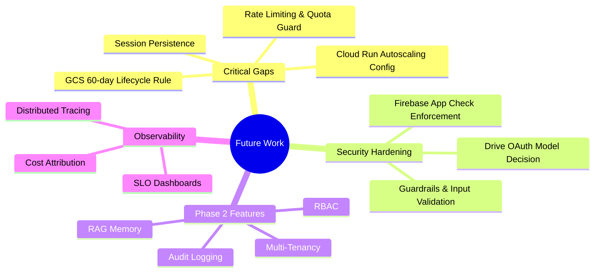
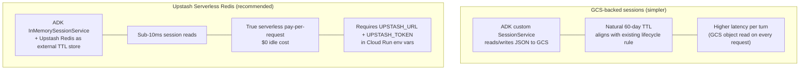
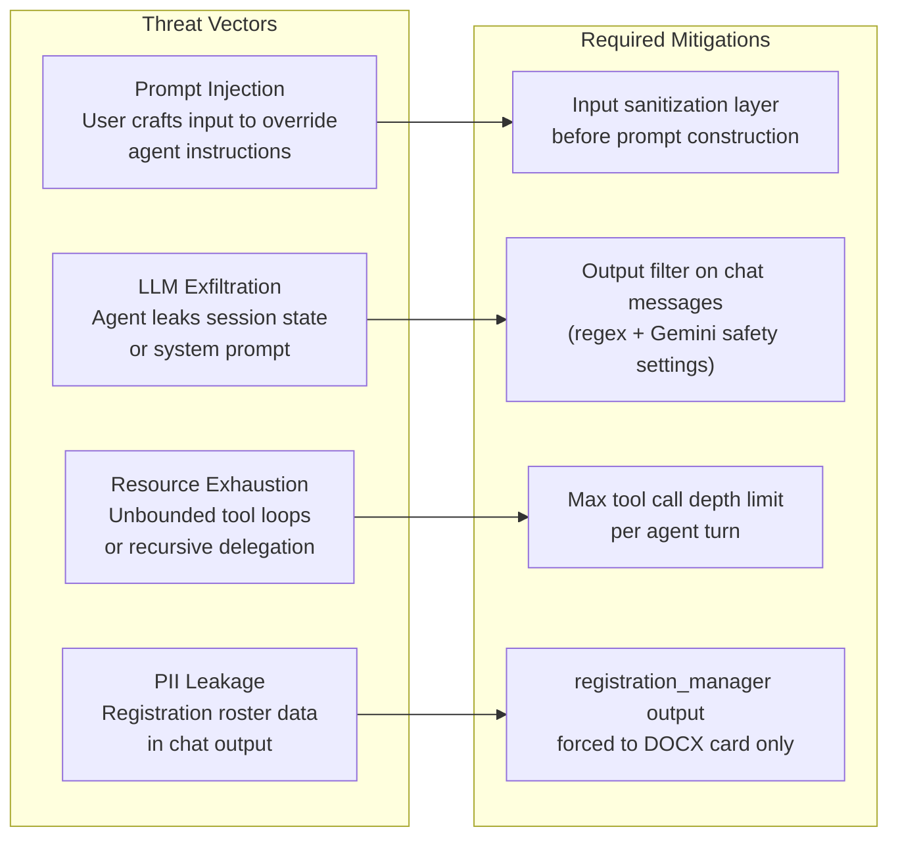
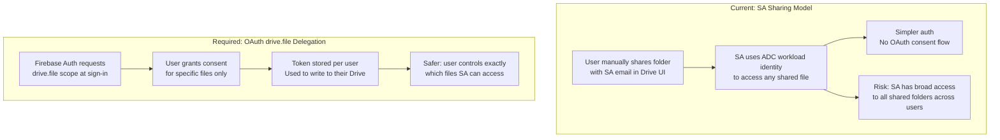
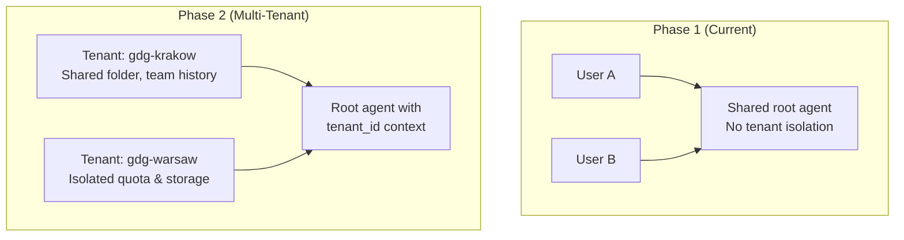
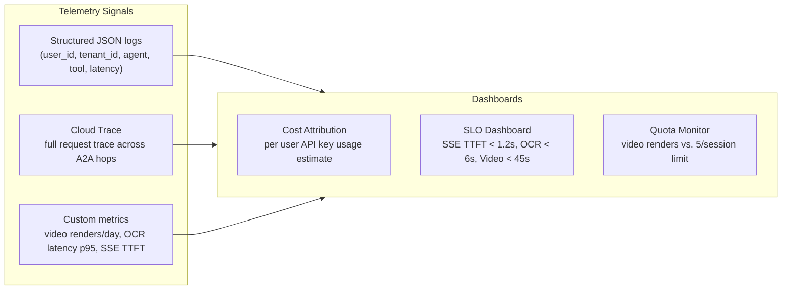

# Future Development Plan
## Community AI Studio — Roadmap & Technical Debt

> **Document Version:** 1.0.0
> **Status:** Living Document
> **Audience:** Lead Engineers, Platform Architects

---

## Overview

This document captures identified gaps between the approved architecture baseline and the current implementation, plus the Phase 2 roadmap. Items are ordered by risk impact, not complexity.



---

## 1. Critical Infrastructure Gaps

### 1.1 GCS Lifecycle Rule — 60-Day Auto-Delete (NFR-04.1)

**Current state:** `terraform/storage.tf` creates the bucket with no lifecycle rule. Storage grows unbounded.

**Fix:** Add to `google_storage_bucket.assets_bucket`:

```hcl
lifecycle_rule {
  condition { age = 60 }
  action    { type = "Delete" }
}
```

**Effort:** 30 minutes. Zero risk — only affects objects older than 60 days.

---

### 1.2 Cloud Run Concurrency & Autoscaling (NFR-01.2)

**Current state:** `terraform/cloudrun.tf` sets no concurrency or instance scaling annotations. All three services use Cloud Run defaults (80 concurrency, unbounded instances).

**Target configuration** (derived from load model below):

| Service | `max_concurrency` | `min_instance_count` | `max_instance_count` |
|:---|:---:|:---:|:---:|
| `community-root-agent` | 80 | 0 | 2 |
| `video-editor-a2a` | 2 | 0 | 4 |
| `receipt-scanner-a2a` | 10 | 0 | 2 |

**Load model (Europe organizer-tool traffic, not participant traffic):**
- Baseline: ~25 sessions/day; peak burst (conference season) = 5× → 125 sessions/day
- Spread over 8h workday, ~20min session duration → **~15 concurrent sessions at burst peak**
- Safety margin: **2× peak** (standard for non-critical stateless services)

| Service | Peak concurrent | × 2× safety | Per-instance capacity | Max instances |
|:---|:---:|:---:|:---:|:---:|
| `community-root-agent` | 15 SSE streams | 30 | 80 concurrency | 2 |
| `video-editor-a2a` | 3 renders (20% of sessions) | 6 | 2 concurrency | 4 (+1 cold-start) |
| `receipt-scanner-a2a` | 5 OCR jobs (30% of sessions) | 10 | 10 concurrency | 2 |

**Fix:** Add `scaling` block and `max_instance_request_concurrency` to each service template in `cloudrun.tf`:

```hcl
template {
  scaling {
    min_instance_count = 0
    max_instance_count = 75
  }
  max_instance_request_concurrency = 2
  ...
}
```

**Risk note:** At max=4 instances × concurrency=2, maximum simultaneous Veo API calls = 8. Verify Veo API quota supports this before deploying.

---

### 1.3 Video Render Quota (NFR-02.2)

**Current state:** No render quota exists. A single session can trigger unlimited video renders, exhausting `video-editor-a2a` Cloud Run compute.

**Quota principle:** Only limit features that cost the platform (Cloud Run compute for video rendering). Do not limit LLM usage — BYOK means the user's own API key absorbs those costs and Google's own quota enforcement applies.

**Target limit:** Max 5 video renders per session.

**Implementation:** Session state counter in root agent — zero infra required.

```python
# In agents/root_agent/agent.py, before delegating to video-editor-a2a:
render_count = tool_context.session.state.get("video_render_count", 0)
if render_count >= 5:
    return "Video render limit reached for this session (max 5)."
tool_context.session.state["video_render_count"] = render_count + 1
```

**Limitation:** Counter is in-memory and resets on Cloud Run instance restart. Acceptable — "per session" is inherently ephemeral. If persistent enforcement is needed later, move counter to Firestore keyed by `session_id`.

---

### 1.4 Session State Persistence (NFR-04.2)

**Current state:** ADK uses in-memory session state. Session history is lost when a Cloud Run instance restarts or scales to zero.

**Impact:** Users lose conversation context between sessions; no cross-session memory; state inconsistency during scale-out.

**Requirements:** Session state backed by GCS objects (`gs://${project_id}-storage/sessions/`) or Serverless Redis (Upstash) with 60-day TTL.

**Options:**



**Action items:**
- Provision Upstash Redis instance (or use GCS alternative)
- Implement `RedisSessionService` adapter wrapping ADK `BaseSessionService`
- Wire into `agents/root_agent/agent.py` initialization
- Add `UPSTASH_REDIS_URL` and `UPSTASH_REDIS_TOKEN` secret vars to `terraform/cloudrun.tf` (via `google_secret_manager_secret`)

---

## 2. Security Hardening

### 2.1 Agent Guardrails & Input Validation

**Current state:** No input sanitization or output guardrails exist on agent prompts. The system trusts all user input passed directly to Gemini.

**Identified risks:**



**Implementation targets:**
- `agents/common/guardrails.py` — shared sanitizer + output filter module
- Per-agent `max_tool_calls` parameter in ADK agent config
- Extend `registration_manager` agent instruction to enforce DOCX-only output (currently enforced by prompt — should be enforced by code)
- Enable Gemini safety settings: `HARM_BLOCK_THRESHOLD_UNSPECIFIED → BLOCK_LOW_AND_ABOVE` for harassment/hate categories

**Priority: HIGH** — PII redaction is partially enforced by prompt instruction only. Code-level enforcement is needed before production traffic.

---

### 2.2 Google Drive Auth Model Clarification (FR-03.3 / GAP-05)

**Current implementation:** SA-sharing model — users share their Drive folder with `studio_sa` email; SA authenticates via ADC workload identity.

**Requirements specify:** Incremental OAuth `drive.file` scope delegation at sign-in.

These are fundamentally different trust models:



**Decision required from stakeholder:** The SA-sharing model is live and working. Migrating to OAuth delegation requires:
- Firebase Auth scope update (`auth/drive.file` added to sign-in provider)
- Token storage and refresh in the backend (cannot use ADC; need per-user `google.oauth2.credentials.Credentials`)
- Significant changes to `agents/receipt_scanner/google_auth.py` and `tools.py`

**Decision:** Keep SA-sharing for Phase 1. Implement OAuth delegation in Phase 2 alongside RBAC. **Priority: Low.**

---

### 2.3 Firebase App Check Enforcement Gaps

**Current state:** App Check is initialized in `frontend/src/lib/firebase.js` with reCAPTCHA v3. However, App Check enforcement is only effective if the backend Cloud Run service validates App Check tokens.

**Current gap:** The root agent (`adk api_server`) does not validate Firebase App Check tokens. A user with direct access to the Cloud Run URL can bypass App Check entirely.

**Fix options:**
- Add Firebase Admin SDK App Check token verification middleware to `adk api_server` startup
- Or use Firebase Hosting rewrites exclusively and block direct Cloud Run URL access via `ingress=internal-and-cloud-load-balancing` (requires adding a load balancer — adds cost)

---

## 3. Phase 2 Roadmap

### 3.1 Multi-Tenancy (Organization Workspaces)



**Changes required:**
- `tenant_id` claim in Firebase Auth custom token
- Session state namespaced by `tenant_id`
- GCS bucket path prefix: `gs://${bucket}/tenants/${tenant_id}/`
- Quota enforcement per tenant (not just per user)

---

### 3.2 Role-Based Access Control (RBAC)

| Role | Capabilities |
|:---|:---|
| Super Admin | All agents, quota management, tenant config |
| Chapter Lead | All event agents, view all member sessions |
| Event Organizer | All event agents, own sessions only |
| Guest | Read-only, no video generation |

**Implementation:** Firebase Auth custom claims + root agent middleware checking `user.claims.role` before routing.

---

### 3.3 Persistent RAG Memory

**Goal:** Agent retains knowledge across event seasons — past speakers, recurring venues, typical agendas.

**Stack:** Vertex AI Vector Search + Cloud Firestore for metadata. ADK `VertexAiRagMemoryService` as memory backend.

**Scope:**
- Per-tenant memory corpus: past events, speaker profiles, venue contacts
- `event_planner` reads memory to avoid rescheduling past conflicts
- `agenda_generator` reads memory to apply community-standard time slots

---

### 3.4 Observability & Cost Attribution

**Current state:** Logging only via Cloud Logging (`roles/logging.logWriter`). No structured metrics, no per-user cost attribution, no SLO dashboards.

**Target state:**



**Action items:**
- Instrument `agents/common/` with `google-cloud-trace` spans wrapping tool calls
- Add `structlog` JSON formatter to all agents
- Create Cloud Monitoring dashboards for the three latency SLOs (NFR-05.1–05.3)
- Tag all logs with `user_id` and `session_id` for cost attribution queries

---

## 4. Technical Debt Register

| ID | Area | Description | Priority |
|:---|:---|:---|:---:|
| TD-01 | `storage.tf` | Missing 60-day GCS lifecycle rule | Critical |
| TD-02 | `cloudrun.tf` | Missing concurrency and autoscaling config | High |
| TD-03 | Root agent | No video render quota (max 5/session); LLM turns intentionally unlimited (BYOK) | High |
| TD-04 | Session state | In-memory only; lost on restart or wrong-instance routing | Critical |
| TD-05 | Guardrails | PII redaction enforced by prompt only | High |
| TD-06 | App Check | Backend does not validate App Check tokens | Medium |
| TD-07 | Drive auth | Migrate to OAuth `drive.file` + Google Drive Picker (Phase 2, requires per-user token infra) | Low |
| TD-08 | IAM | Remove project-level `sa_run_invoker` from `iam.tf`; service-level bindings in `cloudrun.tf` already exist and are correctly scoped | High |
| TD-09 | Docs | `setup_guide.md` §5 references stale `receipt-docs-bot` SA | Low |
| TD-10 | Docs | `DEPLOYMENT_GUIDE.md` §6 references stale SA setup | Low |
| TD-11 | Observability | No distributed tracing across A2A hops | Medium |
