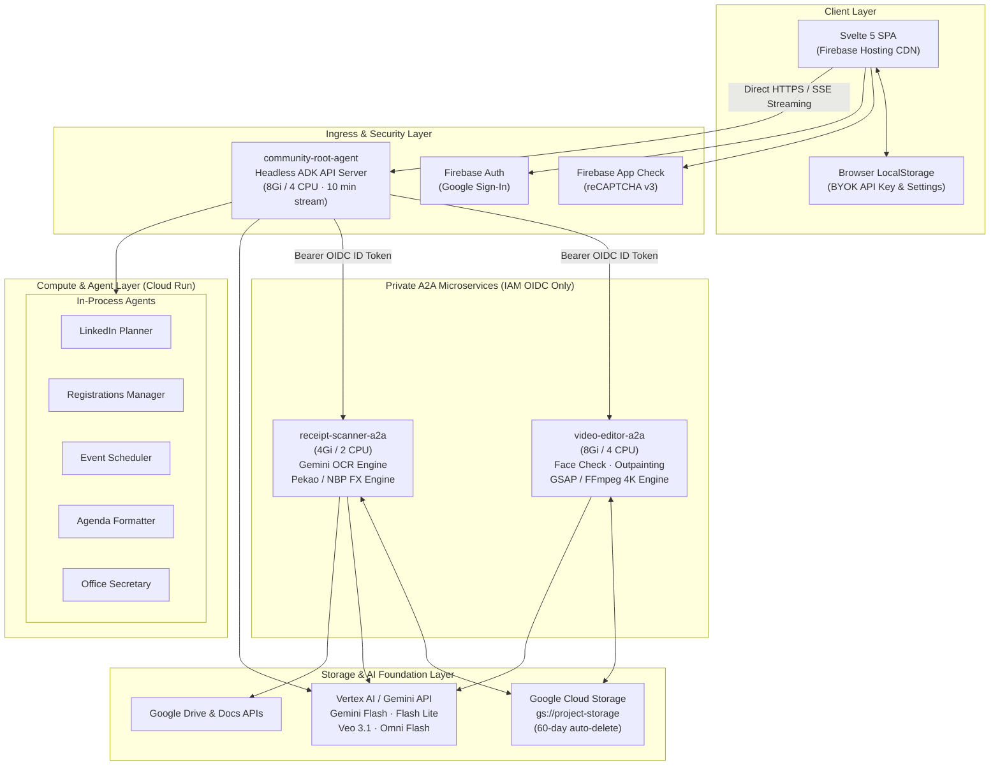
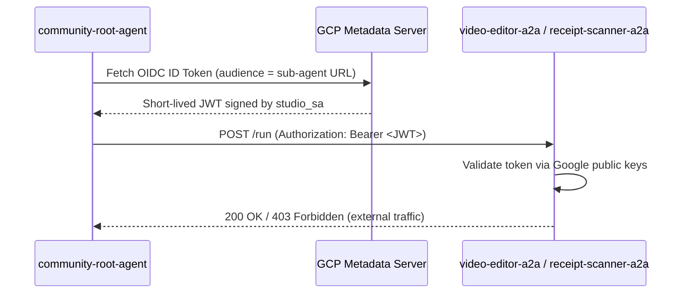
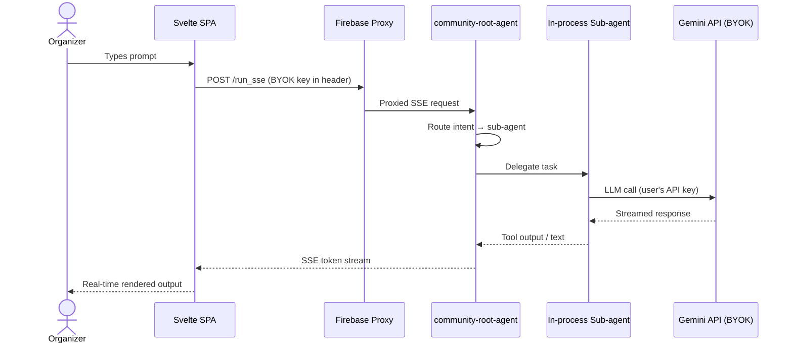
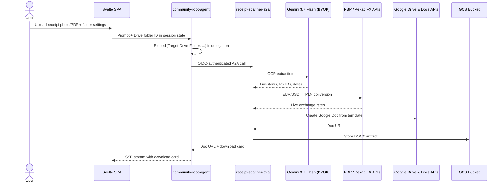
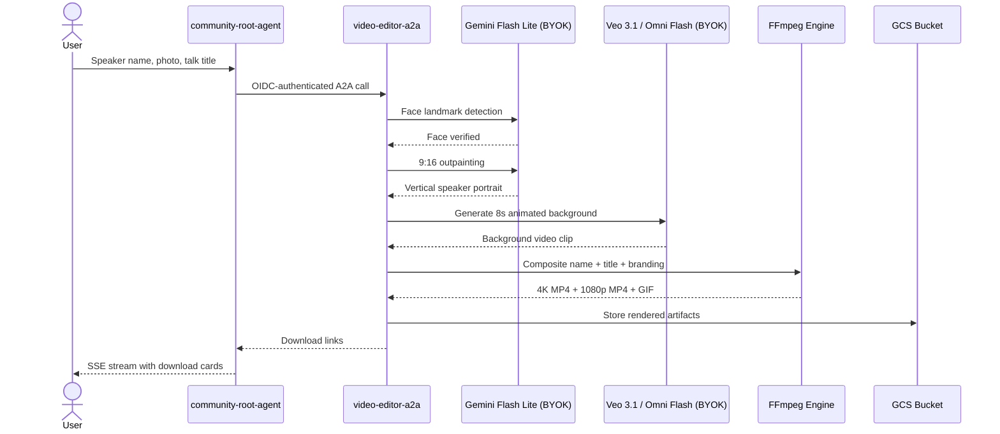
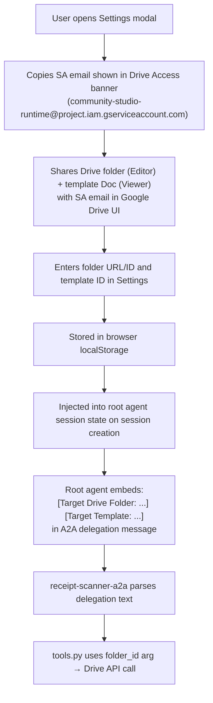

# Solution Architecture Document
## Community AI Studio — GDG & Community Multi-Agent Workspace

> **Document Version:** 1.0.0
> **Architecture Baseline:** Approved
> **Classification:** B2C Community Platform
> **Source Requirements:** `SOLUTION_ARCHITECTURE_REQUIREMENTS.md` v1.0.0

---

## 1. Executive Summary

Community AI Studio is a multi-agent orchestration platform for community leaders and event organizers. It automates end-to-end event operations: agenda calculation, speaker announcement posters and cinematic video intros, participant roster deduplication, holiday clash detection, and receipt OCR with expense reporting.

**Operating model:**
- ~20,000 registered users, 12,000–36,000 sessions/year
- Peak: 500 simultaneous users during conference seasons
- BYOK (Bring Your Own Key): users supply Gemini API keys — $0 LLM cost to platform
- Ephemeral 60-day data retention, scale-to-zero infrastructure
- Non-critical SLA (best-effort ~99.0%)

---

## 2. Architecture Overview

> **Visual Assets**: [🖼️ PNG Diagram](file:///Users/aplachykau/Experiments/gdg_krakow_tool/docs/assets/architecture_diagram.png) • [📄 PDF Document](file:///Users/aplachykau/Experiments/gdg_krakow_tool/docs/assets/architecture_diagram.pdf) • [📐 SVG Vector](file:///Users/aplachykau/Experiments/gdg_krakow_tool/docs/assets/architecture_diagram.svg)



---

## 3. Component Inventory

### 3.1 Cloud Run Services

| Service | CPU | RAM | Ingress | Auth | Purpose |
|:---|:---:|:---:|:---|:---|:---|
| `community-root-agent` | 4 vCPU | 8 GiB | All (Firebase proxy) | `--allow-unauthenticated` | Root orchestrator, in-process agents |
| `video-editor-a2a` | 4 vCPU | 8 GiB | All | `--no-allow-unauthenticated` | Face detection, outpainting, 4K render |
| `receipt-scanner-a2a` | 2 vCPU | 4 GiB | All | `--no-allow-unauthenticated` | OCR, FX conversion, Drive export |

All services run as `community-studio-runtime` Service Account (`studio_sa`) defined in `terraform/iam.tf`.

### 3.2 In-Process Agents (root agent sub-agents)

| Agent | Module | Responsibility |
|:---|:---|:---|
| `root_agent` | `agents/root_agent/` | Intent routing and orchestration |
| `linkedin_post_generator` | `agents/linkedin_post_generator/` | Social copy, recaps, hashtags |
| `registration_manager` | `agents/registration_manager/` | Roster dedup, CSV partitioning, PII redaction |
| `event_planner` | `agents/event_planner/` | Polish/EU holiday detection, meetup conflict check |
| `agenda_generator` | `agents/agenda_generator/` | Minute-level slot snapping, timeline format |
| `office_secretary` | `agents/office_secretary/` | Key access and venue reservation email drafts |

### 3.3 Infrastructure (Terraform)

| Resource | File | Description |
|:---|:---|:---|
| Cloud Run services | `terraform/cloudrun.tf` | All three services + IAM invoker bindings |
| Service Account | `terraform/iam.tf` | `studio_sa` with least-privilege IAM roles |
| GCS Bucket | `terraform/storage.tf` | Asset storage + Artifact Registry |
| Outputs | `terraform/outputs.tf` | Exposes `service_account_email` for deploy scripts |
| APIs | `terraform/apis.tf` | Enables required GCP service APIs |

---

## 4. Security Architecture

```mermaid
flowchart LR
    subgraph BROWSER["Browser"]
        SPA["Svelte SPA"]
        KEY["BYOK API Key\n(localStorage)"]
    end

    subgraph GCP_EDGE["GCP Edge"]
        AC["Firebase App Check\nreCAPTCHA v3"]
        FH["Firebase Hosting\nReverse Proxy"]
        FA["Firebase Auth\nGoogle Sign-In"]
    end

    subgraph GCP_PRIVATE["GCP Private (IAM)"]
        RA["community-root-agent\n(Public via proxy)"]
        VA["video-editor-a2a\n(Private: IAM only)"]
        RS["receipt-scanner-a2a\n(Private: IAM only)"]
        SA["community-studio-runtime\nService Account"]
    end

    SPA -->|Token check| AC
    SPA -->|Google Sign-In| FA
    SPA -->|HTTPS + BYOK header| FH
    FH -->|Proxied| RA
    RA -->|OIDC ID Token (SA)| VA
    RA -->|OIDC ID Token (SA)| RS
    SA -.->|Workload Identity| VA
    SA -.->|Workload Identity| RS
```

### 4.1 IAM Roles (`studio_sa`)

| Role | Scope |
|:---|:---|
| `roles/logging.logWriter` | Project |
| `roles/cloudtrace.agent` | Project |
| `roles/aiplatform.user` | Project |
| `roles/storage.objectUser` | `${project_id}-storage` bucket only |
| `roles/run.invoker` | `video-editor-a2a`, `receipt-scanner-a2a` only |

### 4.2 A2A Authentication Flow



### 4.3 Privacy Controls

- `registration_manager` enforces strict PII redaction: participant names/emails never appear in chat output; deliverables emitted as downloadable DOCX/TXT cards only (FR-04.1, NFR-03.5)
- Headless mode: root agent runs `adk api_server`; `/web/` debug UI returns 404

---

## 5. Request & Data Flow

### 5.1 Standard Agent Request



### 5.2 Receipt Scanner (A2A) Flow



### 5.3 Video Editor (A2A) Flow



---

## 6. Google Drive Integration

Each user shares their own Google Drive folder and Docs template with the platform service account. The SA email is surfaced in the Settings modal (`VITE_STUDIO_SA_EMAIL` Vite env var, read from `terraform output service_account_email` at build time).



**Auth chain:** `studio_sa` → ADC workload identity (`GOOGLE_AUTH_METHOD=adc` env var) → `google.auth.default()` in `agents/receipt_scanner/google_auth.py`

---

## 7. Capacity Planning

| Metric | Target | Peak | Implementation |
|:---|:---|:---|:---|
| Registered users | 20,000 | +200%/yr | Firebase Auth |
| Annual sessions | 12,000–36,000 | ~100/day | Cloud Run scale-to-zero |
| Peak concurrent | 500 users | 500 SSE streams | Cloud Run autoscaling |
| Light workloads (70%) | 350 concurrent | Text/scheduling | In-process agents |
| Heavy workloads (30%) | 150 concurrent | Video/OCR | Private A2A workers |
| Media storage | ~50 MB/session | ~1.8 TB total | GCS + 60-day lifecycle |

### Target Cloud Run Scaling (see §8 GAP-02 for derivation)

Baseline: ~25 sessions/day average; 5× peak burst = 125 sessions/day → ~15 concurrent sessions at burst peak.

| Service | Max Concurrency | Min | Max | Derivation |
|:---|:---:|:---:|:---:|:---|
| `community-root-agent` | 80 | 0 | 2 | 15 sessions × 2× safety = 30 SSE streams; fits in 1 instance at concurrency=80; 2nd for redundancy |
| `video-editor-a2a` | 2 | 0 | 4 | 20% video sessions × 2× safety = 6 renders; ⌈6/2⌉=3 instances + 1 cold-start buffer |
| `receipt-scanner-a2a` | 10 | 0 | 2 | 30% OCR sessions × 2× safety = 10 jobs; fits in 1 instance at concurrency=10; 2nd for redundancy |

---

## 8. Requirement Alignment & Gaps

The following requirements from `SOLUTION_ARCHITECTURE_REQUIREMENTS.md` are **not yet fully implemented** in the current codebase. Each is a known gap that requires action before the system can be considered fully conformant with the approved architecture baseline.

### GAP-01: GCS Lifecycle Rule Missing (NFR-04.1)

| | |
|:---|:---|
| **Requirement** | GCS bucket auto-deletes objects older than 60 days |
| **Current state** | `terraform/storage.tf` defines the bucket with no `lifecycle_rule` block |
| **Impact** | Storage grows unbounded; no data retention enforcement |
| **Action** | Add `lifecycle_rule` to `google_storage_bucket.assets_bucket` in `storage.tf` |

```hcl
lifecycle_rule {
  condition { age = 60 }
  action    { type = "Delete" }
}
```

### GAP-02: Cloud Run Concurrency & Autoscaling Not Configured (NFR-01.2)

| | |
|:---|:---|
| **Requirement** | Each service must have explicit `max_concurrency`, `min_instance_count`, `max_instance_count` |
| **Current state** | `terraform/cloudrun.tf` sets no scaling annotations; Cloud Run uses defaults |
| **Impact** | Under peak load (500 concurrent), root agent may accept > 80 requests/instance causing latency; video renderer may spawn too many instances |
| **Action** | Add scaling config to each service's `template` block in `cloudrun.tf` |

### GAP-03: No Video Render Quota (NFR-02.2 — partial)

| | |
|:---|:---|
| **Requirement** | Max 5 video rendering generations per session |
| **Current state** | No render counter exists; users can trigger unlimited video renders per session |
| **Impact** | Single session can exhaust `video-editor-a2a` Cloud Run compute capacity |
| **Note** | LLM turn limits (100/day) are not implemented and are intentionally deferred — BYOK means the user's own API key absorbs LLM costs. Only platform-cost features (Cloud Run compute for video rendering) warrant quota enforcement. |
| **Action** | See `FUTURE_DEVELOPMENT.md` §1.3 for implementation plan |

### GAP-04: No Persistent Session State / Redis (NFR-04.2)

| | |
|:---|:---|
| **Requirement** | Session memory backed by Serverless Redis (Upstash) or GCS objects with 60-day TTL |
| **Current state** | ADK uses in-memory session state; no external store configured |
| **Impact** | Session state lost on instance restart or scale-to-zero; with 2 root agent instances users may land on the wrong instance mid-conversation and lose context |
| **Accepted risk** | Tolerable at current scale (max 2 instances, ~15 concurrent sessions). Cloud Run best-effort routing reduces frequency of cross-instance misses. |
| **Action** | Implement before scaling root agent beyond 2 instances. See `FUTURE_DEVELOPMENT.md` §1.4 — marked Critical. |

### GAP-05: Drive Auth Model vs. Requirements (FR-03.3)

| | |
|:---|:---|
| **Requirement** | Incremental Google OAuth delegation with `drive.file` scope at sign-in |
| **Current state** | Users share Drive folder with SA email; SA uses ADC workload identity (`GOOGLE_AUTH_METHOD=adc`) |
| **Decision** | SA-sharing model is live and functionally equivalent for Phase 1. OAuth `drive.file` scope cannot write to arbitrary folders by ID — correct implementation requires Google Drive Picker integration plus per-user token management. Deferred to Phase 2. |
| **Action** | See `FUTURE_DEVELOPMENT.md` §2.2 — Low priority. |

---

## 9. Deployment

Two deployment paths are supported:

### 9.1 Terraform (Recommended)

```bash
# Prerequisites: gcloud auth, terraform init, .env with project vars
./deploy/deploy_terraform.sh
```

Steps performed:
1. Enable GCP APIs
2. Set up Artifact Registry
3. Build & push container images via Cloud Build
4. Generate `terraform.tfvars` if absent
5. `terraform apply` (provisions all Cloud Run, IAM, Storage, networking)
6. Extract `studio_sa` email via `terraform output service_account_email`
7. Build frontend with `VITE_STUDIO_SA_EMAIL` injected
8. Deploy to Firebase Hosting

### 9.2 Direct Cloud Run (gcloud)

```bash
# Prerequisites: gcloud auth, SA already provisioned
./deploy/deploy_a2a_cloudrun.sh
```

Steps performed:
1. Enable GCP APIs
2. Create/verify `community-studio-runtime` SA
3. Grant minimal IAM roles
4. Build & deploy each Cloud Run service via Cloud Build
5. Configure IAM invoker bindings between services
6. Build frontend with `VITE_STUDIO_SA_EMAIL`
7. Deploy to Firebase Hosting

### 9.3 Post-Deploy User Setup (per-user Drive)

1. Open the app → Settings
2. Copy the SA email from the Drive Access banner
3. In Google Drive: share your event folder (Editor) and template Doc (Viewer) with that email
4. Paste folder URL and template Doc URL into Settings → Save
5. Receipt scanner will now export directly to your Drive

---

## 10. Requirements Traceability

| Req ID | Description | Implementation | Status |
|:---|:---|:---|:---:|
| FR-01.1 | Multi-agent intent routing | `agents/root_agent/agent.py` | Implemented |
| FR-01.2 | A2A bidirectional state handoffs | `agents/common/a2a_auth.py` + OIDC | Implemented |
| FR-02.1 | Face landmark detection | `agents/video_editor/tools/media_tools.py` | Implemented |
| FR-02.2 | 9:16 outpainting | `agents/video_editor/tools/media_tools.py` | Implemented |
| FR-02.3 | Veo 3.1 / Omni video generation | `agents/video_editor/tools/media_tools.py` | Implemented |
| FR-02.4 | 4K MP4 + GIF composite | `agents/video_editor/tools/composer_tools.py` | Implemented |
| FR-03.1 | Receipt OCR (Gemini 3.7) | `agents/receipt_scanner/tools.py` | Implemented |
| FR-03.2 | NBP / Pekao FX rates | `agents/receipt_scanner/tools.py` | Implemented |
| FR-03.3 | Drive export / DOCX download | `agents/receipt_scanner/tools.py` (SA model) | Partial — see GAP-05 |
| FR-04.1 | Roster dedup + PII redaction | `agents/registration_manager/` | Implemented |
| FR-04.2 | Holiday conflict detection | `agents/event_planner/` | Implemented |
| FR-04.3 | Agenda formatting | `agents/agenda_generator/` | Implemented |
| FR-04.4 | Venue email drafting | `agents/office_secretary/` | Implemented |
| FR-05.1 | Svelte 5 SPA | `frontend/` | Implemented |
| FR-05.2 | SSE streaming `/run_sse` | `frontend/src/App.svelte` | Implemented |
| FR-05.3 | BYOK onboarding modal | `frontend/src/lib/SettingsModal.svelte` | Implemented |
| NFR-01.2 | Cloud Run concurrency limits | `terraform/cloudrun.tf` | **GAP-02** |
| NFR-02.2 | Rate limiting / quota guard | — | **GAP-03** |
| NFR-03.1 | Firebase Auth (Google Sign-In) | `frontend/src/lib/firebase.js` | Implemented |
| NFR-03.1 | Drive access via ADC workload identity; full `drive` + `documents` scopes (`google_auth.py`) — broad scope is intentional: SA access is bounded by what users explicitly share in Drive UI | `agents/receipt_scanner/google_auth.py` | Implemented |
| NFR-03.2 | Private A2A (IAM OIDC) | `terraform/cloudrun.tf` + `a2a_auth.py` | Implemented |
| NFR-03.3 | Least-privilege IAM | `terraform/iam.tf` | Implemented |
| NFR-03.4 | App Check + headless API | `firebase.js` + `adk api_server` | Implemented |
| NFR-03.5 | PII redaction | `agents/registration_manager/` | Implemented |
| NFR-04.1 | 60-day GCS lifecycle TTL | `terraform/storage.tf` | **GAP-01** |
| NFR-04.2 | Serverless Redis session store | — | **GAP-04** |
| NFR-06.1 | Europe region deployment | `terraform/variables.tf` (`europe-central2`) | Implemented |
