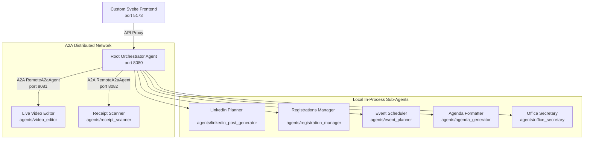

# 🚀 Community AI Studio - Setup & Operations Guide

Welcome to the comprehensive setup and operations guide for **Community AI Studio**. This project is a multi-agent orchestration workspace built using the [Google Agent Development Kit (ADK) 2.0](https://adk.dev/) in Python (powered by Vertex AI and Gemini models) paired with a high-performance, responsive **Svelte + Vite** custom frontend.

---

## 🏗️ System Architecture

The project consists of three main layers:



1. **Custom Svelte Frontend (`frontend/`)**: A dark-themed, premium workspace that provides a chat interface, real-time status ticker for the agents, and capability highlights.
2. **Root Orchestrator Agent (`agents/root_agent/`)**: The main coordinating Python agent that receives user requests, determines the correct domain, and delegates tasks to the appropriate specialized sub-agents.
3. **Sub-Agents Core (`agents/`)**: Seven specialized sub-agents covering receipts/expense reporting, speaker video generation, social media management, guest lists, meetup scheduling, agenda formatting, and office access letters.

---

## 📋 Prerequisites

Ensure you have the following installed on your machine:

* **Python 3.12+** (to run ADK and agent packages)
* **uv** (to manage Python dependencies)
* **Node.js v22+** (to run the custom Svelte frontend and the HyperFrames render server)
* **FFmpeg** (strongly recommended, used for video rendering and processing tasks)
* **Google Cloud SDK / CLI** (for Vertex AI authentication)

---

## 🛠️ Step-by-Step Setup

Follow these steps to set up both the backend and frontend environments.

### 1. Python Environment (Backend)

Synchronise the locked backend dependencies:

```bash
uv sync --locked
```

### 2. Node.js Environment (Frontend & Video Editor)

Install the Node packages for both the Svelte workspace and the rendering engine:

```bash
# Install Svelte UI dependencies
cd frontend
npm install
cd ..

# Install HyperFrames rendering dependencies
cd agents/video_editor
npm install
cd ../..
```

### 3. Vertex AI Authentication (only for Vertex mode)

If `GOOGLE_GENAI_USE_VERTEXAI=1`, authenticate your local environment with Google Cloud to grant Vertex AI API access:

```bash
bash <(curl -sSL https://storage.googleapis.com/cloud-samples-data/adc/setup_adc.sh)
```

*Provide your GCP Project ID (e.g., `agents-123`) when prompted and complete authentication in your browser. When using `GOOGLE_GENAI_USE_VERTEXAI=0`, skip this step and configure `GOOGLE_API_KEY` instead.*

### 4. Configuration Settings (.env)

The system uses a **single unified `.env` file** located in the project root directory. All agents, A2A microservices (Video Editor, Receipt Scanner), and test suites automatically read from this root file. You can use the template [.env.example](../.env.example) to create it:

```bash
# Copy the example configuration to .env
cp .env.example .env
```

Open `.env` and configure the following parameters:
* `GOOGLE_API_KEY`: Your preferred API key from [Google AI Studio](https://aistudio.google.com/). It is used when `GOOGLE_GENAI_USE_VERTEXAI=0`; all Gemini model calls then use this key instead of Vertex credentials.
* `GEMINI_API_KEY`: Backwards-compatible fallback when `GOOGLE_API_KEY` is not configured.
* `GOOGLE_GENAI_USE_VERTEXAI`: Set to `1` to run Gemini calls through Vertex AI endpoints, or `0` to run Gemini calls through the Gemini Developer API. In API mode, `GOOGLE_API_KEY` or `GEMINI_API_KEY` must be set.
* `GOOGLE_CLOUD_PROJECT`: Your GCP Project ID from [Google Cloud Console](https://console.cloud.google.com/).
* `VIDEO_ENGINE`: Video generation engine — set to `veo` (Vertex AI Google Veo 3.1) or `omni` (Google AI Gemini Omni Flash preview via Interactions API). API mode requires `omni`; `veo` is rejected because it requires Vertex AI.
* `ENABLE_VIDEO_GENERATION`: Set to `true` to run live AI video animation, or `false` for layout-only dry-runs using local placeholder media.
* `RENDER_4K`: Set to `true` to render high-resolution 4K Ultra-HD MP4 compositions.
* `RENDER_ORDINARY`: Set to `true` (default) to render 1080p Full-HD MP4 compositions.
* `RENDER_GIF`: Set to `true` (default) to generate animated GIF previews via FFmpeg.

> [!NOTE]
> **Google Drive & Docs Storage**: Target folder URLs/IDs and custom template documents are configured dynamically per-user in the Web UI **Settings (⚙️)** modal, rather than stored in `.env`.

> [!TIP]
> **Unified Configuration**: Avoid placing separate `.env` files inside individual subdirectories (`agents/root_agent/`, `agents/receipt_scanner/`, etc.). The workspace root `.env` serves as the single source of truth for all microservices.

### 5. Google Drive & Google Docs Storage Architecture (Bring Your Own Drive)

The **Receipt Scanner** sub-agent generates native **Google Docs** directly in Google Drive using a modern, zero-admin multi-tenant model.

#### Primary Mode: Personal Google Sign-In (User-Delegated OAuth) — Recommended
- **No Service Account Setup Required**: When users log in via **"Sign in with Google"** in the web interface, the system uses user-delegated OAuth tokens.
- **Dynamic Configuration**: Each user enters their private **Google Drive Folder URL / ID** and optional **Custom Template URL / ID** directly in **Settings (⚙️)**.
- **Strict Privacy & $0 Storage Cost**: Reports are written directly to each user's private Google Drive folder. Folders and reports remain 100% private to the user without needing to share permissions with external service accounts.

---

#### Optional Mode: Unattended Backend Service Account (CLI / Batch Scripts Only)
For headless batch jobs or automated CI scripts running without user interaction:

1. **Enable APIs**:
```bash
gcloud services enable docs.googleapis.com drive.googleapis.com --project=YOUR_PROJECT_ID
```

2. **Create Service Account**:
```bash
gcloud iam service-accounts create receipt-docs-bot \
  --description="Service Account for Google Docs & Drive Expense Reports" \
  --display-name="Receipt Docs Bot" \
  --project=YOUR_PROJECT_ID
```

3. **Generate Key (Saved to `configs/service_account.json`)**:
```bash
mkdir -p configs
gcloud iam service-accounts keys create configs/service_account.json \
  --iam-account=receipt-docs-bot@YOUR_PROJECT_ID.iam.gserviceaccount.com \
  --project=YOUR_PROJECT_ID
```

> [!TIP]
> **Hybrid Generation & Fallback**: When `configs/service_account.json` is present and access is granted, the agent directly creates real Google Docs with live editable URLs (`https://docs.google.com/document/d/.../edit`). If offline or without cloud credentials, it automatically falls back to generating standard `.docx` files.

### 6. Customizing the Expense Report Template

* **Google Docs Template**: To customize the cloud template, create a copy of the default template, modify it, and update `agents/receipt_scanner/assets/Expense_report_template.gdoc` with the new `"doc_id"`.
* **Local .docx Template**: Edit `agents/receipt_scanner/assets/expense_report_template.docx` in Word or LibreOffice. Tag placeholders like `{{TITLE}}`, `{{Current date}}`, `{{EUR/USD}}`, `{{Category}}`, `{{Desc}}`, `{{SUM CURR}}`, `{{APPROVED}}`, and `{{PROOFS}}` are populated dynamically.

---

## 🚀 Running the Entire Project

### Recommended: Single Command (`make run-all`)

The easiest way to start all background A2A services (Video Editor on 8081, Receipt Scanner on 8082), the ADK Web Orchestrator on 8080, and the Svelte frontend dev server on 5173 is:

```bash
make run-all
```

*Press `Ctrl+C` in the terminal to gracefully stop all services.*

---

### Alternative: Multi-Terminal Launch

If you prefer to start components individually in separate terminal sessions:

#### Terminal 1: Video Editor A2A Service (Port 8081)

```bash
uv run --locked uvicorn agents.video_editor.a2a_server:a2a_app --host 0.0.0.0 --port 8081
```

#### Terminal 2: Receipt Scanner A2A Service (Port 8082)

```bash
uv run --locked uvicorn agents.receipt_scanner.a2a_server:a2a_app --host 0.0.0.0 --port 8082
```

#### Terminal 3: Root Orchestrator (Port 8080)

```bash
VIDEO_AGENT_A2A_URL=http://localhost:8081 RECEIPT_AGENT_A2A_URL=http://localhost:8082 \
  uv run --locked adk web --port 8080 agents
```

#### Terminal 4: Launch Frontend (Svelte Dev Server)

```bash
cd frontend
npm run dev
```

### Open the Application

Now, open your browser and navigate to:
👉 **[http://localhost:5173](http://localhost:5173)**

Here you will find the **Community AI Studio** workspace where you can select the active agent, start new chat sessions, type requests, and drag-and-drop receipts or participant rosters directly.

---

## ☁️ Production Deployment (Cloud Run & Firebase)

To build container images with Google Cloud Build and deploy all services to Google Cloud Run and Firebase Hosting:

```bash
# Full deployment of all services and web app
make deploy

# Or frontend-only deployment to Firebase Hosting
make deploy-frontend
```

---

## 🛠️ Alternative & Diagnostic Operations

### 1. Using the Default ADK Developer UI

If you want to use the default web playground provided out-of-the-box by ADK:

```bash
uv run --locked adk web --port 8000 agents
```

Open **`http://localhost:8000`** in your browser.

### 2. Testing Receipt Scanner via CLI

You can test the receipt OCR scanner and currency converter directly using the test runner:

```bash
uv run --locked python tests/test_receipt_scanner.py
```

### 3. HyperFrames Development & Preview Sandbox

To preview the video composition layout, debug GSAP timelines, or check visual spacing:

```bash
# Run local dev server with hot-reload and visual preview (scrub timeline at http://localhost:3000)
npm run video:dev

# Run linter, Chrome validation and layout checks
npm run video:check

# Render composition to an MP4 video file locally
npm run video:render
```

---

## 🧹 Code Quality & Formatter

Before pushing any Python updates, make sure your code aligns with our Ruff styling guidelines (line-length is capped at `120` characters):

```bash
# Format Python files
ruff format .

# Check for lint errors and warnings
ruff check .

# Apply auto-fixes
ruff check --fix .
```
